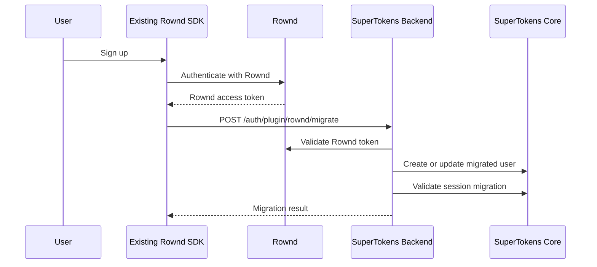

# Rownd to SuperTokens Migration Tutorial

This tutorial explains the full migration flow from Rownd to SuperTokens. The migration is phased so you can lazily migrate new users as they sign up, bulk import the existing Rownd user base, and then switch clients to SuperTokens-backed Rownd SDKs.

The goal is to keep the existing Rownd-facing integration surface stable while authentication, sessions, and user data move to SuperTokens behind the scenes.

## Migration Overview

The migration has three steps:

1. **Lazy migration**: Add the `supertokens-node` together with the `@supertokens-plugins/rownd-nodejs` plugin to your backend, then update the existing Rownd SDKs to versions that call the backend migration endpoint after successful Rownd sign-in or sign-up.
2. **Bulk migration**: Export existing Rownd users and import them into SuperTokens.
3. **Cutover**: Replace the Rownd SDKs with the SuperTokens Rownd packages so clients start using SuperTokens for auth.

The order matters. First validate that newly active users can be mirrored safely through the backend plugin, then import the existing user base, and only then switch authentication traffic to SuperTokens.

## Step 1: Lazy Migration

Lazy migration has two parts.
First, set up your backend with SuperTokens and the Rownd migration plugin.
Then update your existing Rownd SDKs so they call the backend migration endpoint after successful Rownd sign-in or sign-up.

The same backend SDK and plugin remain in place for the final cutover. The SuperTokens Rownd SDKs introduced in Step 3 use these same backend endpoints.

### 1.1 Backend: Install the Plugin

```bash
npm install supertokens-node @supertokens-plugins/rownd-nodejs
```

### 1.2 Backend: Configure SuperTokens with the Plugin

Initialize SuperTokens with the Rownd migration plugin before your server starts listening:

```typescript
import SuperTokens from "supertokens-node";
import Session from "supertokens-node/recipe/session";
import UserMetadata from "supertokens-node/recipe/usermetadata";
import AccountLinking from "supertokens-node/recipe/accountlinking";
import Passwordless from "supertokens-node/recipe/passwordless";
import ThirdParty from "supertokens-node/recipe/thirdparty";
import EmailVerification from "supertokens-node/recipe/emailverification";
import RowndMigrationPlugin from "@supertokens-plugins/rownd-nodejs";

SuperTokens.init({
  supertokens: {
    connectionURI: "<SUPERTOKENS_CONNECTION_URI>",
    apiKey: "<SUPERTOKENS_API_KEY>",
  },
  appInfo: {
    appName: "APP_NAME",
    apiDomain: "<API_DOMAIN>",
    websiteDomain: "<WEBSITE_DOMAIN>",
    apiBasePath: "/auth",
  },
  recipeList: [
    AccountLinking.init({
      shouldDoAutomaticAccountLinking: async () => ({
        shouldAutomaticallyLink: true,
        shouldRequireVerification: true,
      }),
    }),
    Session.init(),
    UserMetadata.init(),
    Passwordless.init({
      contactMethod: "EMAIL_OR_PHONE",
      flowType: "MAGIC_LINK",
    }),
    EmailVerification.init({
      mode: "OPTIONAL",
    }),
    ThirdParty.init({
      signInAndUpFeature: {
        providers: [
          {
            config: {
              thirdPartyId: "google",
              clients: [
                {
                  clientId: "<GOOGLE_CLIENT_ID>",
                  clientSecret: "<GOOGLE_CLIENT_SECRET>",
                },
              ],
            },
          },
          {
            config: {
              thirdPartyId: "apple",
              clients: [
                {
                  clientId: "<APPLE_CLIENT_ID>",
                  additionalConfig: {
                    teamId: "<APPLE_TEAM_ID>",
                    keyId: "<APPLE_KEY_ID>",
                    privateKey: "<APPLE_PRIVATE_KEY>",
                  },
                },
              ],
            },
          },
        ],
      },
    }),
  ],
  experimental: {
    plugins: [
      RowndMigrationPlugin.init({
        rowndAppKey: process.env.ROWND_APP_KEY!,
        rowndAppSecret: process.env.ROWND_APP_SECRET!,
      }),
    ],
  },
});
```

A complete backend-only example is available in `packages/rownd-nodejs/example`.

### 1.3 Backend: Migration Endpoint Behavior

When `POST {apiDomain}{apiBasePath}/plugin/rownd/migrate` is called, for example `POST /auth/plugin/rownd/migrate` when `apiBasePath` is `/auth`, the plugin:

1. Validates the Rownd access token via Rownd's API.
2. Checks whether the user already exists in SuperTokens.
3. Imports the user into SuperTokens if needed.
4. Creates a SuperTokens session to validate session migration.
5. Stores the original Rownd data in UserMetadata.

For native/header-token clients, call the endpoint with `rid: session`, `fdi-version: 1.18`, and `st-auth-mode: header`. A successful migration response must include `st-access-token`, `st-refresh-token`, and `front-token`; clients should treat a 2xx response missing any of these headers as an incomplete session migration.

`Session` and `UserMetadata` are required for migration. `ThirdParty` is required for Google, Apple, guest, and anonymous login methods. `Passwordless` is required for email and phone login methods. `EmailVerification` is required for verified email profile updates. `AccountLinking` should be initialized so migrated identities can link according to your account-linking policy.

The example above enables automatic linking with verification required so migrated Rownd identities can attach to matching verified SuperTokens users. Review trusted providers, verified identifiers, and guest upgrade flows before using the same policy in production.

Do not expose SuperTokens Core directly to the public internet. Use a Core API key for any shared or deployed instance, and store Rownd, OAuth, and Core credentials in environment variables or a secret manager.

For production, add rate limits and abuse protection around migration and guest session endpoints.

### 1.4 Client: Enable Lazy Migration in Existing Rownd SDKs

After the backend is deployed, update the existing Rownd SDKs to versions that know how to call your SuperTokens migration endpoint.

Use the final published versions when they are available. These dummy versions are placeholders:

```text
@rownd/react@3.0.2
io.rownd:android:5.0.0
https://github.com/rownd/ios.git:4.0.1
```

During this step, apps still authenticate through Rownd. The SDK adds a fire-and-forget call to `POST {apiDomain}{apiBasePath}/plugin/rownd/migrate` after successful sign-up. If that migration request fails, the SDK does not block the user's Rownd auth flow.

This step covers new signups after the SDK update is deployed. That means new users created after that are mirrored into SuperTokens before the bulk migration and final cutover.
Since we are focusing just on new sign ups you do not need to force users to update their app version before the bulk migration. Existing Rownd users are handled by the bulk migration in Step 2, and active sessions are handled during cutover.



### 1.5 React

```tsx
import { RowndProvider } from "@rownd/react";

function App() {
  return (
    <RowndProvider
      appKey="your_rownd_app_key"
      supertokens={{
        appInfo: {
          appName: "<APP_NAME>",
          apiDomain: "<API_DOMAIN>",
          apiBasePath: "/auth",
        },
      }}
    >
      <YourApp />
    </RowndProvider>
  );
}
```

### 1.6 Android

```kotlin
import android.app.Application
import io.rownd.android.Rownd
import io.rownd.android.RowndConfigureOptions

class MyApplication : Application() {
    override fun onCreate() {
        super.onCreate()

        Rownd.configure(
            this,
            RowndConfigureOptions(
                appKey = BuildConfig.ROWND_APP_KEY,
                apiDomain = BuildConfig.ROWND_API_DOMAIN,
                apiBasePath = BuildConfig.ROWND_API_BASE_PATH,
            )
        )
    }
}
```

### 1.7 iOS

```swift
import Rownd
import UIKit

func application(_ application: UIApplication, didFinishLaunchingWithOptions launchOptions: [UIApplication.LaunchOptionsKey : Any]? = nil) -> Bool {
    let apiDomain = "https://api.example.com"
    let apiBasePath = "/auth"

    Task {
        await Rownd.configure(
            launchOptions: launchOptions,
            appKey: "YOUR_ROWND_APP_KEY",
            supertokens: RowndSuperTokensConfig(
                appName: "Your App",
                apiDomain: apiDomain,
                apiBasePath: apiBasePath
            )
        )
    }

    return true
}
```

### 1.8 Validation

Before moving to bulk migration, validate these flows in staging and then production:

1. New signups are mirrored in SuperTokens.
2. Guest or anonymous user migration works if your app supports guest auth.
3. Google and Apple users map to the expected SuperTokens identities.
4. Email and phone users map to the expected Passwordless identities.
5. SuperTokens session creation succeeds during the migration request.

## Step 2: Bulk Migration

After lazy migration is live, we'll run the bulk migration for the existing Rownd user base. This imports all the existing users from Rownd.
The operation will be done from the SuperTokens side by connecting your Rownd account to SuperTokens Core.

Generate the config, add the Rownd and Core credentials, and leave `limit`
unset so the production migration processes every Rownd user:

```bash
npx rownd-nodejs init-config --output ./rownd-bulk-migrate.yaml
```

Start only when `GET /bulk-import/users/count` reports zero. The migration CLI
enforces this for a fresh run, stages the mapped users, and writes a manifest
beside its checkpoint. Do not run another Core bulk import until this migration
has been validated because the status APIs return Core-wide counts.

```bash
npx rownd-nodejs bulk-migrate --config ./rownd-bulk-migrate.yaml
npx rownd-nodejs bulk-import-monitor \
  --config ./rownd-bulk-migrate.yaml \
  --wait \
  --output ./migration-progress.ndjson
```

Core imports staged users asynchronously. The monitor polls the total and the
`NEW`, `PROCESSING`, and `FAILED` counts. If failed users remain, export them:

```bash
npx rownd-nodejs bulk-import-failures \
  --config ./rownd-bulk-migrate.yaml \
  --output ./migration-failures.ndjson
```

Before cutover, validate that Core has processed every staged record:

```bash
npx rownd-nodejs bulk-import-validate \
  --config ./rownd-bulk-migrate.yaml \
  --output ./migration-validation.json
```

Proceed only when validation returns exit code `0` and reports `COMPLETE`.
This confirms the documented bulk-import lifecycle completed; it is not a
field-by-field readback of imported user data.

## Step 3: Cutover to SuperTokens-backed Rownd SDKs

After lazy migration validation and bulk migration are complete, switch client authentication traffic from Rownd to SuperTokens by replacing the Rownd SDKs with the SuperTokens Rownd packages.

The SuperTokens Rownd SDKs keep Rownd-compatible frontend APIs where possible, but they use the SuperTokens-backed Rownd Hub and the same backend SDK and plugin configured in Step 1.

Use the final published versions when they are available. These dummy versions are placeholders:

```text
@supertokens/rownd-react
@supertokens/rownd-nextjs
com.github.supertokens:supertokens-rownd-android:v0.0.1-beta.4
https://github.com/supertokens/supertokens-rownd-ios.git:v0.0.1-beta.5
```

During this final step:

1. Active sessions should migrate without requiring users to sign in again.
2. The frontend keeps using Rownd-compatible APIs.
3. The underlying authentication flow moves from Rownd to SuperTokens.

### 3.1 React

Install the SuperTokens Rownd React SDK:

```bash
npm install @supertokens/rownd-react@<FINAL_CUTOVER_VERSION>
```

Update imports from `@rownd/react` to `@supertokens/rownd-react`:

```tsx
import { RowndProvider } from "@supertokens/rownd-react";

function App() {
  return (
    <RowndProvider
      appKey="<ROWND_APP_KEY>"
      supertokens={{
        appInfo: {
          appName: "<APP_NAME>",
          apiDomain: "<API_DOMAIN>",
          apiBasePath: "/auth",
        },
      }}
    >
      <YourApp />
    </RowndProvider>
  );
}
```

The public APIs such as `RowndProvider`, `useRownd()`, `requestSignIn()`, `SignedIn`, `SignedOut`, and `RequireSignIn` stay Rownd-compatible.

### 3.2 Next.js

Install the SuperTokens Rownd Next.js SDK:

```bash
npm install @supertokens/rownd-nextjs@<FINAL_CUTOVER_VERSION>
```

At minimum, update imports from the Rownd Next.js package to `@supertokens/rownd-nextjs`, configure `supertokens.appInfo`, and add the token callback middleware route:

```ts
// middleware.ts
import { NextResponse } from "next/server";
import { withRowndMiddleware } from "@supertokens/rownd-nextjs/server";
import { rowndServerConfig } from "./rowndConfig";

export const middleware = withRowndMiddleware(() => {
  return NextResponse.next();
}, rowndServerConfig);

export const config = {
  matcher: ["/api/rownd-token-callback", "/profile/:path*"],
};
```

Server helpers validate SuperTokens JWTs through `{apiDomain}{apiBasePath}/jwt/jwks.json` and fetch Rownd-compatible user data from `{apiDomain}{apiBasePath}/plugin/rownd/user`.

### 3.3 iOS

Add the SuperTokens Rownd iOS SDK as a Swift Package dependency:

```text
https://github.com/supertokens/supertokens-rownd-ios
```

Select version `<FINAL_CUTOVER_VERSION>` and configure the SDK with your SuperTokens backend details:

```swift
import UIKit
import Rownd

func application(
    _ application: UIApplication,
    didFinishLaunchingWithOptions launchOptions: [UIApplication.LaunchOptionsKey: Any]? = nil
) -> Bool {
    Task {
        await Rownd.configure(
            launchOptions: launchOptions,
            appKey: "<ROWND_APP_KEY>",
            supertokens: RowndSuperTokensConfig(
                appName: "<APP_NAME>",
                apiDomain: "<API_DOMAIN>",
                apiBasePath: "/auth"
            )
        )
    }

    return true
}
```

### 3.4 Android

Add the SuperTokens Rownd Android SDK:

```text
https://github.com/supertokens/supertokens-rownd-android
```

Use version `<FINAL_CUTOVER_VERSION>` and configure the SDK in your `Application` class:

```kotlin
import android.app.Application
import io.rownd.android.Rownd
import io.rownd.android.RowndConfigureOptions

class MyApplication : Application() {
    override fun onCreate() {
        super.onCreate()

        Rownd.configure(
            this,
            RowndConfigureOptions(
                appKey = "<ROWND_APP_KEY>",
                apiDomain = "<API_DOMAIN>",
                apiBasePath = "/auth",
            )
        )
    }
}
```

### 3.5 Final Cutover Checks

Before considering the migration complete:

1. Confirm new signups are created only in SuperTokens-backed auth.
2. Confirm existing migrated users can sign in without duplicates.
3. Confirm active Rownd sessions migrate to SuperTokens sessions.
4. Confirm sign-out clears the expected client and backend session state.
5. Confirm protected backend APIs validate SuperTokens sessions.
6. Confirm analytics, logs, and support tooling no longer depend on Rownd-only identifiers unless they are copied to SuperTokens metadata.
